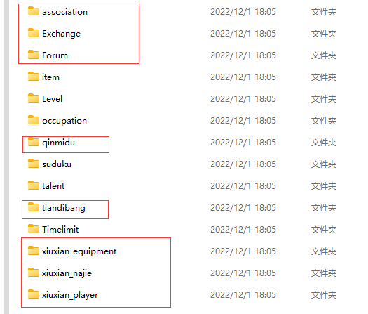

# 魔改修仙V1.2「修真界」
## 玩家攻略：
[修仙攻略](https://docs.qq.com/doc/DSUhqZWdpZXJuUndZ?&u=4bd0757f64094c48b02d7cfc4eaeb44b)  
## 访问量：        
<br> <br>       
## 安装      

> Yunzai-Bot/目录下执行  
```
git clone  https://gitee.com/xyb12345678qwe/mogaixiuxian/.git ./plugins/xiuxian-emulator-plugin/

```           
## 转移存档            
     
存档位置  
```
\Yunzai-Bot\plugins\xiuxian-emulator-plugin\resources\data
```      
若要转移存档，将上面画框的文件保存，将修仙插件删除，执行上面安装命令，将上面画框的文件替换到对应文件,然后执行【#一键同步】               
## 更新完后一定要发【#一键同步】，不要偷懒直接保存data文件夹
## 魔改内容
1.增加修真界，修真界命令为，#世界#前往世界xxx#沉迷世界xxx#供奉修真石;

2.增加斗破苍穹界;

3.增加佛界
## 指令
1.修仙帮助      
## 交流/直接游玩      
- 一服：678120561    
## 鸣谢
> 名字(3407318235):仓库主人,写新功能      
## 配置与存档   
>xiuxian-emulator-plugin/ config / xiuxian / xiuxian.yaml       
>xiuxian-emulator-plugin/ resources / data          
>可根据需求自行修改     
## 免责声明       
1. 功能仅限内部交流与小范围使用       
2. 请勿用于任何以盈利为目的的场景     
    
